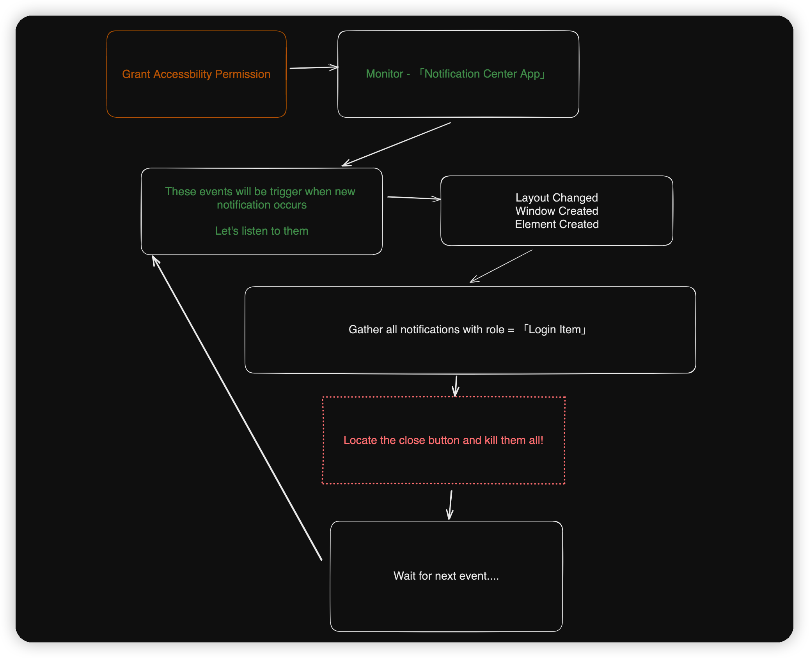

#  BIAN Killer

BIAN(Background items added notification) killer helps you kill all these stupid & annoying notifications automatically.

<video src="https://user-images.githubusercontent.com/51731239/220240911-cab0ecaa-0c9c-481d-8d99-dbfd2553d50a.mp4"></video>

# How did it works?

Check the file [NotificationMonitor.swift](BackgroundItemsAddedKiller/Source/NotificationMonitor.swift)

In short:

# Apple, do better.
We don't have time for this shit, fix it ASAP!
